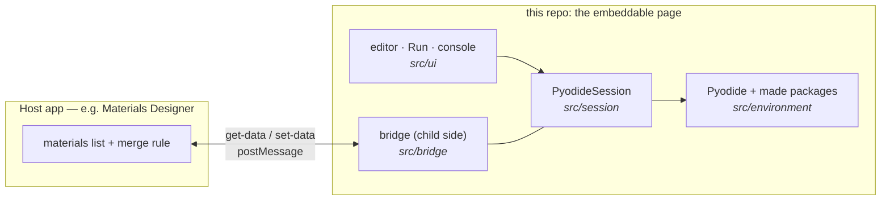

# pyodide-repl

A Python REPL for the browser: [Pyodide](https://pyodide.org) session management, an editor/console
UI, and an **embeddable page** that talks to whatever hosts it over the same iframe data bridge the
mat3ra JupyterLite deploy speaks. All Pyodide and Python concerns live here; visual components come
from [cove](https://github.com/mat3ra/cove); host apps only embed and answer bridge messages.



**Read the source in this order** — each file answers one question:

| # | Path | Lines | Answers |
| --- | --- | --- | --- |
| 1 | `src/environment/madeProfile.ts` | 99 | What Python packages exist, and the namespace users see |
| 2 | `src/session/PyodideSession.ts` | 348 | How the interpreter loads, installs, runs, and reports errors |
| 3 | `src/bridge/` | 141 | How materials come in and results go out (2 actions) |
| 4 | `src/app/MaterialsReplApp.tsx` | 59 | The wiring: three callbacks connect 1–3 |
| 5 | `src/ui/` | 326 | The editor and console around it |

Everything else is completions (163), the page entry (15), tests (432), and config.

## 1. Embedding

Embed the deployed page in an iframe and wire the two bridge actions — identical to embedding
JupyterLite (cove's `JupyterLiteSession` + `IframeToFromHostMessageHandler` work unchanged):

- **`get-data`** — the REPL asks for the host's current entities before every run. Reply (your
  handler's return value) with an array of material configs, or `{ materials, selectedIndex }` to
  also convey the selection. The REPL binds them as `materials_in` / `material`.
- **`set-data`** — after every run the REPL sends `{ syncScope: "python-repl", entities }`, where
  each entity is `{ type: "material", name, config }` for every public `Material` variable in the
  namespace. Merge them however your app sees fit; re-runs resend the complete set for the scope.

Message envelope: ESSE's `IframeMessageSchema` (`from-host-to-iframe` / `from-iframe-to-host`).
Opened standalone — no embedding host — the entity request times out quietly and `materials_in`
starts empty; everything else works, which is also the quickest way to try the page.

## 2. What's inside

| Piece | Path |
| --- | --- |
| Pyodide session: load (explicit `indexURL`), ordered environment build, persistent-namespace runs, structured errors | `src/session/` |
| Jedi completions + the CodeMirror source they feed | `src/completions/` |
| The `made` environment: package lists, wheels, materials namespace Python | `src/environment/` |
| Bridge child side: transport + host connection | `src/bridge/` |
| Editor/console UI (uses cove CodeMirror) | `src/ui/` |
| The embeddable page | `src/app/`, `src/standalone/` |

Wheels that do not build under Pyodide (`pymatgen`, `spglib`, `pydantic`) are downloaded by
`scripts/provision-wheels.mjs` on `predev`/`prebuild` into `public/packages/` (gitignored) and ship
inside the deployed site — same-origin to the page, so **hosts never serve wheels**.

## 3. Development

```bash
npm install
npm run dev        # provisions wheels, serves the page on :3021
npm test           # lint + transpile + unit tests (tsx --test)
npm run build      # static site in build/
```

Deploys are a static Netlify site (`netlify.toml`), the JupyterLite pattern: every PR gets a deploy
preview a host can embed for testing. WIP package tarballs publish per the `[release]` commit
marker — see `RELEASING.md`.

## 4. Roadmap

- Move the materials namespace Python to `mat3ra-notebooks-utils` once a release carries the host
  bridge (api-examples #355); `src/environment/` then keeps only package lists.
- Read the environment from AX's `config.yml` at build time instead of hardcoded lists.
- Editable requirements, preloading hooks for hosts.
- A browser-level CI test of the page itself (today: unit suite here + the host e2e in MD).
