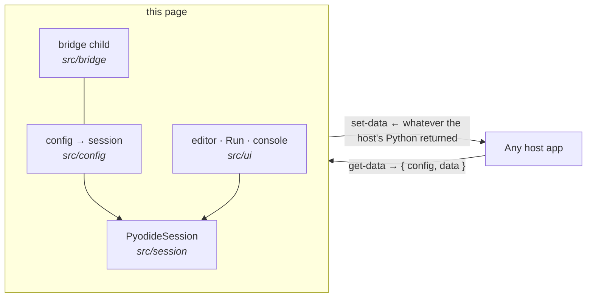

# pyodide-repl

A **generic** Python REPL for the browser: [Pyodide](https://pyodide.org) session management, an
editor/console UI, and an embeddable page that any host drives over the same iframe data bridge the
mat3ra JupyterLite deploy speaks.

It knows nothing about any domain. The host supplies **which packages to install** and **the Python
that binds its data in and reads results back out**; this page runs them. Visual components come
from [cove](https://github.com/mat3ra/cove).



**Read the source in this order** — each file answers one question:

| #   | Path                            | Answers                                                     |
| --- | ------------------------------- | ----------------------------------------------------------- |
| 1   | `src/config/hostConfig.ts`      | What a host may configure, and how config becomes a session |
| 2   | `src/session/PyodideSession.ts` | How the interpreter loads, installs, runs, reports errors   |
| 3   | `src/bridge/`                   | How the two messages move (child side of the ESSE bridge)   |
| 4   | `src/app/ReplApp.tsx`           | The page: ask the host, build the session, render           |
| 5   | `src/ui/`                       | The editor and console                                      |

## 1. Embedding

Embed the page in an iframe and answer two bridge actions — the same handler pattern as embedding
JupyterLite (cove's `IframeToFromHostMessageHandler` works unchanged):

-   **`get-data`** — the page asks on load and before every run. Return
    `{ config, data }`: `config` sets the REPL up (read once), `data` is your current state (read
    every run, so it can never go stale).
-   **`set-data`** — the page sends whatever your `afterRunCode` evaluated to. A JSON string is
    parsed first, so you receive the object your own Python built.

The config, in full:

```ts
{
  environment: {            // data only — no code, no domain knowledge
    loadPackages, pypiPinnedPackages,          // Pyodide builtins, then PyPI pins
    wheelFilenames, wheelBaseUrl,              // prebuilt wheels from any CORS-enabled origin
    postWheelPackages,                         // installed once the wheels are in place
  },
  setupCode,       // Python, once after install: imports, helper definitions
  beforeRunCode,   // Python, before each run; `data_from_host_json` is in scope
  afterRunCode,    // Python, after each run (even a failed one); its value goes to the host
  defaultCode,     // starting editor content
}
```

Opened directly with no host, the request times out and it runs as a plain Python REPL — which is
also the quickest way to try it.

## 2. Development

```bash
npm install
npm run dev        # serves the page on :3021
npm test           # lint + typecheck + unit tests (tsx --test)
npm run build      # static site in build/
```

Deploys are a static Netlify site (`netlify.toml`), the JupyterLite pattern: every PR gets a deploy
preview a host can embed. WIP package tarballs publish per the `[release]` commit marker — see
`RELEASING.md`.

## 3. Roadmap

-   Editable requirements and preload hooks, exposed through the same config.
-   A browser-level CI test of the page (today: unit suite here, plus host-side e2e in the embedder).
